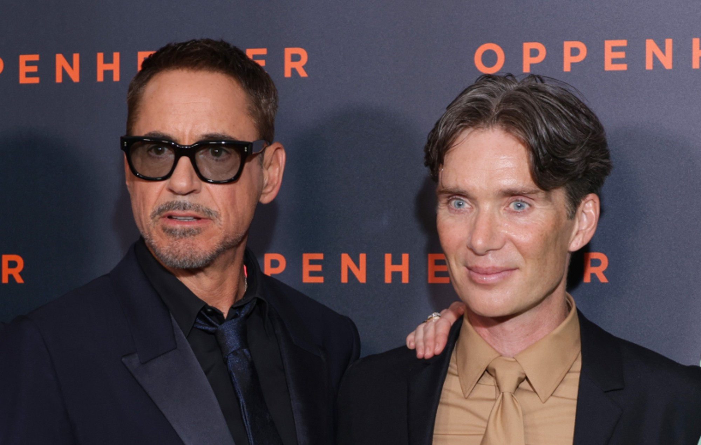

# Viswas Setty
## My Favorite Movie is: Oppenheimer
Oppenheimer is my favorite movie because it portrays a historical figure, **J. Robert Oppenheimer**, the **Father of atomic bomb**, directed by **Christopher Nolan**. It has stunning visuals, a captivating story about the scientific development and the main character is portrayed by **Cillian Murphy** and **Robert Downey Jr**.
